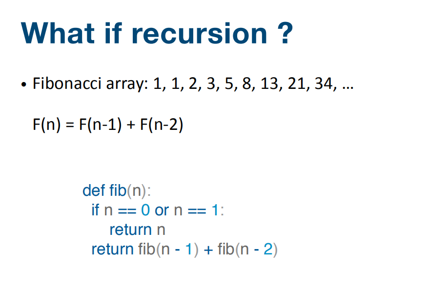

 3.如何计算算法的复杂度？2018年12月29日 （状态：记录）

***

-- What is Big O? --

O(1):  Constant Complexity: Constant 常数复杂度

O(log n):  Logarithmic Complexity: 对数复杂度

O(n):  Linear Complexity: 线性时间复杂度

O(n^2): N square Complexity 平 方

O(n^3): N square Complexity  立 方

O(2^n): Exponential Growth 指数

O(n!): Factorial 阶乘

  补充：计算斐波拉契数列的时间复杂度（递归方式)

 为什么时间复杂度是O(2^n)呢？见下图

怎么推导的还不是特别明白，看这种结构就是 O(2^n)