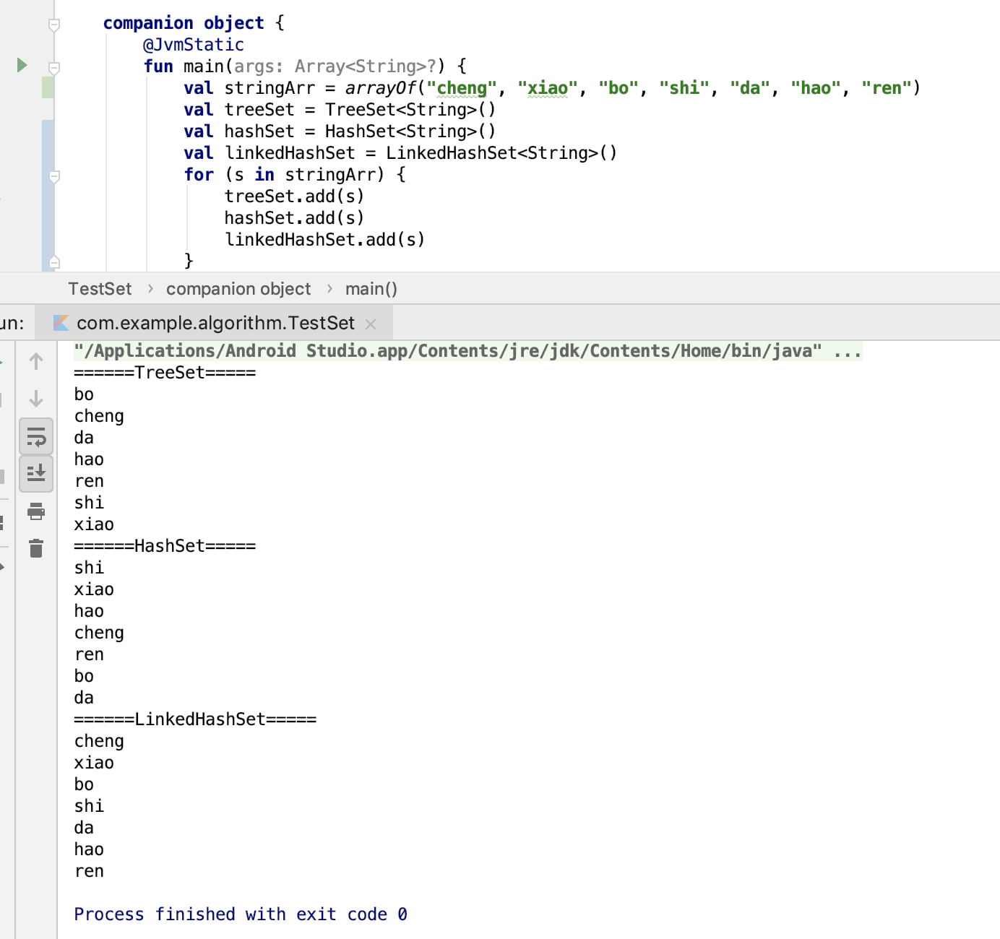

<font size=4 color=#D2691E> Set 学习目标 2019年3月18日（状态：记录）</font>

***

学习目标：   
* 1.HashSet,TreeSet,LinkedHashSet区别？   
* 2.思考Set到底是怎么实现的？   
参考图：<br>
<br>

学习流程：
* 1.首先写了一个小demo  
    <br>
    treeSet的顺序竟然是按照拼音的顺序来的。  
    hashSet的顺序很随意，没有发现任何规律。  
    LinkedHashSet的顺序是Set添加的顺序。

* 2.思考set（自己思考的思路，可能不对哦）：  
    Set的定义规则是：Set是集合，不能有重复的元素。  
    Set的操作
    * 1.添加元素(判断集合中是否有该元素，有的话不再添加)。
    * 2.删除元素(集合中找到该元素，执行删除操作)
    * 3.提供迭代器遍历的功能

    首先要实现上述功能需要一个容器去放这些元素。
    * 1.我们可以用数组和链表-性能不好(所以没有人用这种方式去实现)。
       * 1.1 执行单次添加时，需要判断容器中是否有该元素，添加时-为 O(N)，有该元素不添加 O(N)。
       * 1.2 执行单次删除时，需要判断容器中是否有该元素，有的话删除，数组的时间复杂度为 O(N)。链表的话为O(N)。
    * 2.可以用树去实现，我们可以看到上图，TreeSet->SortedSet 是排好序的Set。现在还没有学到树这种数据结构。但是我们知道树都是 log级 的时间复杂度。（学完树后研究）
    * 3.我们也可以用hash表去实现。什么是Hash表呢？[查看hash表](补充4-hash表.md)<br>
      * 3.1 执行单次添加时，需要判断容器中是否有该元素O(1)。
      * 3.2 执行单次添加时，需要判断容器中是否有该元素O(1)。
      * 3.2 LinkedHashMap 对象是一个链表结构，有一个前节点和后节点的指针，这样就能实现输出顺序是按照添加的顺序输出。

* 3.总结
  * 1.TreeSet是排序的集合。要实现排序的功能用TressSet。
  * 2.LinkedHashSet要维护Set添加的顺序，所以对顺序有要求用LinkedHashSet。
  * 3.HashSet，效率最高，没什么特殊要求用HashSet。

* 4.源码分析(深入分析，敬请期待。。。)
  * 1.TreeSet内部就是用TreeMap实现的(也可以理解，Set就是没有value的hashMap,这样只要有一套实现即可)。
    ```java
    private static final Object PRESENT = new Object();
     
    public TreeSet() {
        this(new TreeMap<E,Object>());
    }
    public boolean add(E e) {
        return m.put(e, PRESENT)==null;
    }
    ```
  * 2.hashSet内部就是用HashMap实现的(也可以理解，Set就是没有value的hashMap,这样只要有一套实现即可)。
    ```java
    private static final Object PRESENT = new Object();

    public HashSet() {
        map = new HashMap<>();
    }
    public boolean add(E e) {
        return map.put(e, PRESENT)==null;
    }
    ```
  * 3.LinkedHashSet的源码相当的简单，没有发现具体怎么实现的排序。还得需要继续分析。???? 继续分析
    ```java
    //这个可能是顺序输出的原因。
    @Override
        public Spliterator<E> spliterator() {
            return Spliterators.spliterator(this, Spliterator.DISTINCT | Spliterator.ORDERED);
        }
    ```
