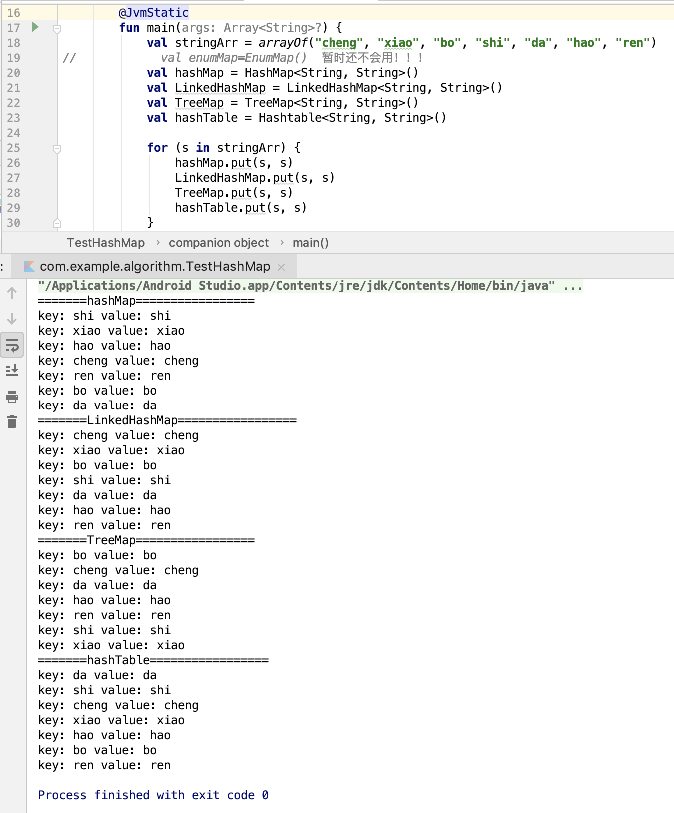

 Map 学习目标 2019年3月18日（状态：记录）

***

学习目标：   
* 1.HashMap、LinkedHashMap、TreeMap、HashTable的区别  
* 2.map是怎么实现的？

参考图：
 

学习流程：
* 1.首先写了一个小demo  
     
    treemap是按照拼音的顺序排列的。  
    hashmap排列顺序很随意，找不到规律。  
    LinkedHashMap是按照map添加的顺序排列的。  
    hashTable排列顺序很随意，找不到规律，并且和hashmap的顺序不一样。  
* 2.思考map 自己思考的思路，可能不对哦）  
    map的定义规则是：map是盛放一个个key-value的容器，每一个key只能出现一次。  
    map的操作
    * 1.添加元素(判断map中是否有key为该元素的键值对，如果有的话，则更新该key对应的value值，没有的话，直接添加)。
    * 2.删除元素(从map中找到key为该元素的键值对，删除)
    * 3.提供迭代器遍历的功能 

   对于数据结构去实现map的优缺点，请参考Set的分析。

* 3.总结：
  * 1.TreeMap是按照key的值进行排序的键值对的集合。要实现排序的功能用TreeMap。
  * 2.LinkedHashMap要维护键值对添加的顺序，所以对顺序有要求用LinkedHashMap。
  * 3.hashTable是线程同步的，如果需要线程同步可以选择hashTable，也可是选择Collections.synchronizedMap()实现。
  * 4.HashMap，效率最高，没什么特殊要求用HashMap。
* 4.源码分析，敬请期待。。。
 